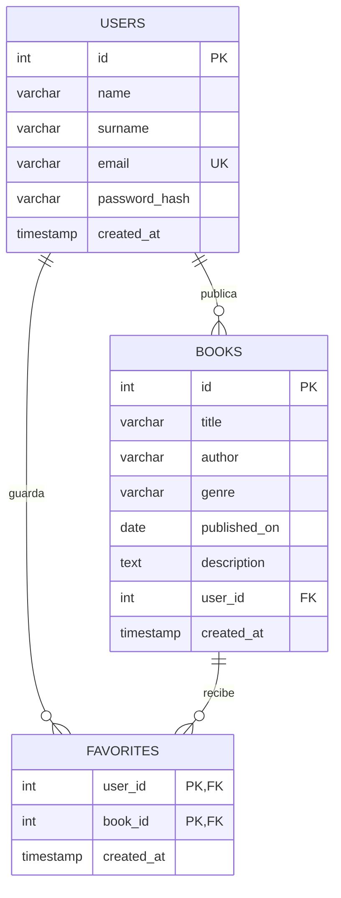

# ERD de BookHub

`users` y `books` tienen una relación uno a muchos: cada libro pertenece a un usuario. `favorites` resuelve la relación muchos a muchos entre lectores y libros; su clave primaria compuesta impide duplicar favoritos. Las claves foráneas usan `ON DELETE CASCADE`.
